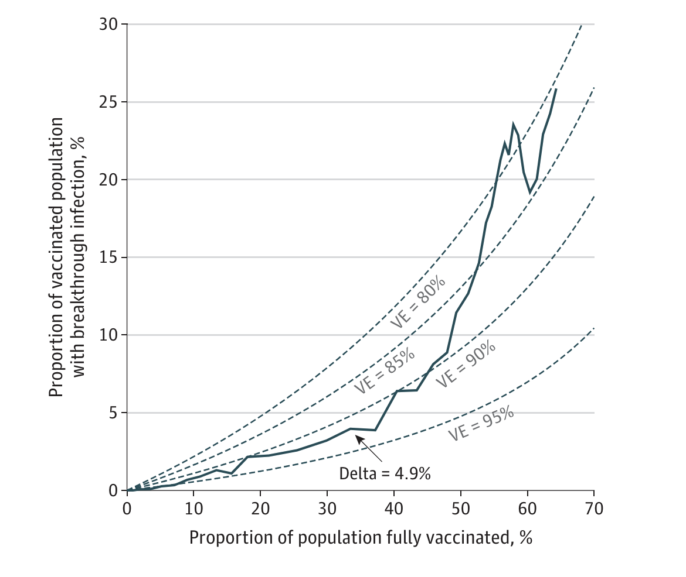

# Analysis of Vaccine Effectiveness Against COVID-19 and the Emergence of Delta and Other Variants of Concern in Utah
by Lindsay Keegan, Shaun Truelove, Justin Lessler

This paper is in press at [JAMA Network Open](https://jamanetwork.com/journals/jamanetworkopen/article-abstract/2787438).

## Description 
The spread of VOCs with significantly higher transmissibility (eg, the Delta variant), has raised concerns about ability for vaccines to sustainably control SARS-CoV-2. These concerns are exacerbated by the increasing number of cases reported in fully vaccinated individuals as the Delta variant spreads globally, potentially signaling a decreased vaccine effectiveness for VOCs. To determine the effectiveness of the vaccines deployed in Utah against testing positive to SARS-CoV-2, we estimated the combined daily vaccine effectiveness ($$VE_t$$) using the field evaluation approach in Orenstein et al.[1985](https://pubmed.ncbi.nlm.nih.gov/3879673/). We calculate the VE using data from [Utah](https://coronavirus-dashboard.utah.gov/overview.html). We then extend this method to understand the rate of breakthrough infections in the face of a rapidly changing variant landscape. If we attribute the entire change in vaccine effectiveness to the Delta variant, the estimated vaccine effectiveness against Delta would be 81.2% (95% CI, 80.8%-81.6%).

Figure 1: The 14-day moving mean of the percentage of breakthrough cases against the percentage of the population vaccinated (blue) from January 16 to October 9, 2021, with the theoretical curves for the expected percentage of breakthrough cases with vaccine effectiveness ranging from 80% to 95% (gray
dashed lines)

## Software implementation

All source code used to generate the results and figures in the paper are in the `code` folder and all data are in the `data` folder. 

## Dependencies

The following R packages are required for this project:

- [`ggplot2`](https://cran.r-project.org/package=ggplot2): for data visualization.
- [`dplyr`](https://cran.r-project.org/package=dplyr): for data manipulation.
- [`lubridate`](https://cran.r-project.org/package=lubridate): for working with dates and times.
- [`cowplot`](https://cran.r-project.org/package=cowplot): for publication-quality plots and arranging multiple plots.
- [`zoo`](https://cran.r-project.org/package=zoo): for working with irregular time series data.
- [`boot`](https://cran.r-project.org/package=boot): for bootstrap methods and functions.

## Data

The data used in this study is provided in `data` and a full description is in the README.md files in the `data` directory. In brief, this study uses publicly avaialbe data from the [Utah COVID data dashboard](https://coronavirus-dashboard.utah.gov/overview.html).

# Contact
For inquiries, please contact lindsay.keegan@utah.edu
